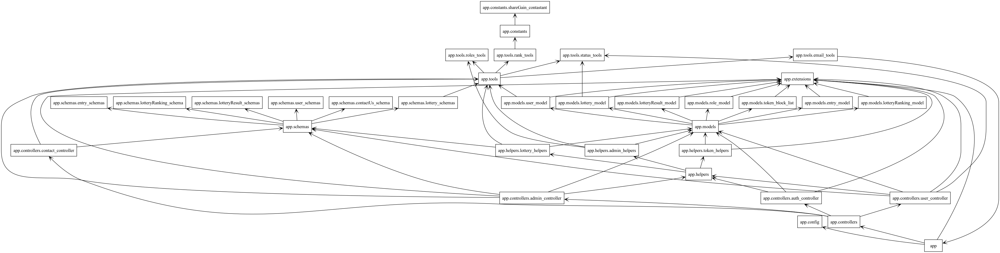
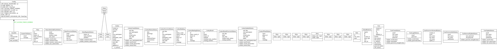

# LotoAppfrontend

LotoAppfrontend est une application développée en Python qui permet aux utilisateurs de participer à des tirages au sort, de consulter les résultats, et de gérer leur compte. Cette application utilise une architecture basée sur Flask pour le backend, et fournit une interface utilisateur intuitive.

## Table des matières

- [Technologies utilisées](#technologies-utilisées)
- [Installation](#Installation)
- [Utilisation](#Utilisation)
- [Fonctionnalités](#Fonctionnalités)
- [Architecture](#Architecture)
- [Note](#Note)

## Technologies utilisées

- **Python**: Langage de programmation principal.
- **Flask**: Framework web pour le backend.
- **SQLAlchemy**: ORM pour la gestion de la base de données.
- **Marshmallow**: Sérialisation et validation des données.
- **JWT**: Gestion de l'authentification des utilisateurs.
- **CORS**: Support des requêtes cross-origin.

## Installation

1. **Clonez le dépôt** :
```bash
   git clone [https://github.com/JagoOgaj/LotoAppfrontend.git](https://github.com/JagoOgaj/lotoAppbackend.git)
   cd LotoAppfrontend
   ```

2. **Créez un environnement virtuel (optionnel mais recommandé) :**
```bash
   python -m venv venv
   source venv/bin/activate  # Sur Windows utilisez `venv\Scripts\activate`
   ```
3. **Installez les dépendances :**
```bash
   pip install -r requirement.txt
   ```

## Utilisation

1. **Démarrez l'application :**
```bash
   python main.py
   ```

## Fonctionnalités

|**Fonctionnalité**                                     |**Utilisateur**                                    |**Administrateur**                                |
|-------------------------------------------------------|---------------------------------------------------|--------------------------------------------------|
| Créer un compte                                       | Oui                                               | Oui                                              |
| Modifier les informations du compte                   | Oui                                               | Oui                                              |
| Modifier le mot de passe                              | Oui                                               | Oui                                              |
| Participer à un tirage                                | Oui                                               | Non                                              |
| Consulter les résultats d'un tirage                   | Oui                                               | Oui                                              |
| Consulter l'historique des tirages                    | Oui                                               | Non                                              |
| Recevoir des notifications (nouveau tirage,résultats) | Oui (par email si activé)                         | Non                                              |
| Créer un tirage                                       | Non                                               | Oui                                              |
| Modifier les informations d'un tirage                 | Non                                               | Oui                                              |
| Supprimer un tirage                                   | Non                                               | Oui                                              |
| Ajouter/Supprimer des utilisateurs dans un tirage     | Non                                               | Oui                                              |
| Définir les résultats gagnants d'un tirage            | Non                                               | Oui                                              |
| Consulter tous les tirages                            | Non                                               | Oui                                              |
| Contacter l'assistance                                | Oui                                               | Oui                                              |


## Architecture
```bash
.
├── README.md                       # Documentation principale du projet
├── app/                            # Répertoire principal de l'application
│   ├── __init__.py                 # Initialisation de l'application Flask
│   ├── config.py                   # Configuration de l'application (base de données, clés, etc.)
│   ├── constants/                  # Constantes partagées dans l'application
│   │   ├── __init__.py
│   │   └── shareGain_contastant.py # Constantes utilisées pour les gains du tirage
│   ├── controllers/                # Contrôleurs gérant les routes de l'API
│   │   ├── __init__.py
│   │   ├── admin_controller.py     # Gestion des fonctionnalités Admin
│   │   ├── auth_controller.py      # Gestion de l'authentification
│   │   ├── contact_controller.py   # Gestion du contact avec le support
│   │   └── user_controller.py      # Gestion des fonctionnalités User
│   ├── extensions.py               # Extensions utilisées dans l'application (JWT, SQLAlchemy, etc.)
│   ├── helpers/                    # Fonctions d'assistance pour l'application
│   │   ├── __init__.py
│   │   ├── admin_helpers.py        # Fonctions spécifiques aux fonctionnalités Admin
│   │   ├── lottery_helpers.py      # Fonctions d'assistance pour la gestion des tirages
│   │   └── token_helpers.py        # Fonctions pour la gestion des tokens JWT
│   ├── models/                     # Modèles de base de données (SQLAlchemy)
│   │   ├── __init__.py
│   │   ├── entry_model.py          # Modèle pour les entrées des utilisateurs dans un tirage
│   │   ├── lotteryRanking_model.py # Modèle pour le classement des utilisateurs dans un tirage
│   │   ├── lotteryResult_model.py  # Modèle pour les résultats des tirages
│   │   ├── lottery_model.py        # Modèle principal du tirage
│   │   ├── role_model.py           # Modèle de gestion des rôles (Admin/User)
│   │   ├── token_block_list.py     # Modèle pour la gestion des tokens bloqués
│   │   └── user_model.py           # Modèle pour les utilisateurs
│   ├── schemas/                    # Schémas de validation pour les requêtes et les réponses
│   │   ├── __init__.py
│   │   ├── contactUs_schema.py     # Schéma pour les requêtes de contact
│   │   ├── entry_schemas.py        # Schéma pour les entrées utilisateur dans un tirage
│   │   ├── lotteryRanking_schema.py# Schéma pour le classement des tirages
│   │   ├── lotteryResult_schemas.py# Schéma pour les résultats des tirages
│   │   ├── lottery_schemas.py      # Schéma pour les tirages
│   │   └── user_schemas.py         # Schéma pour les utilisateurs
│   └── tools/                      # Outils et services partagés dans l'application
│       ├── __init__.py
│       ├── email_tools.py          # Outils pour envoyer des emails (tirage, résultats, contact)
│       ├── rank_tools.py           # Outils pour calculer les gains et classements
│       ├── roles_tools.py          # Outils pour la gestion des rôles (Admin/User)
│       └── status_tools.py         # Outils pour la gestion des statuts des tirages
├── main.py                         # Point d'entrée de l'application
├── requirements.txt                # Liste des dépendances Python du projet
├── seed/                           # Fichier SQL pour peupler la base de données
│   └── database.sql
└── test/                           # Répertoire pour les tests unitaires (vide pour l'instant)
   ```

Voici un diagramme représentant l'architecture du projet :






## Note

Ce projet a été développé dans le cadre de la formation universitaire BUT3 FA Informatique,
pour le module "Qualité de développement". Il s'agit d'un projet pratique permettant
de mettre en application les bonnes pratiques de développement et de gestion de projet en Python.